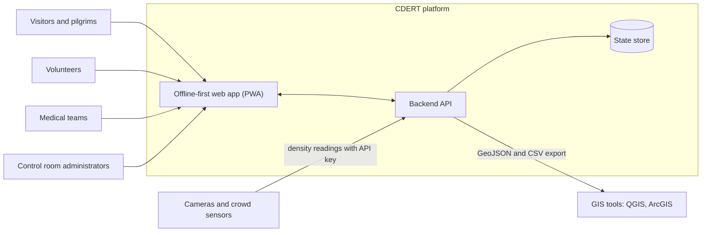
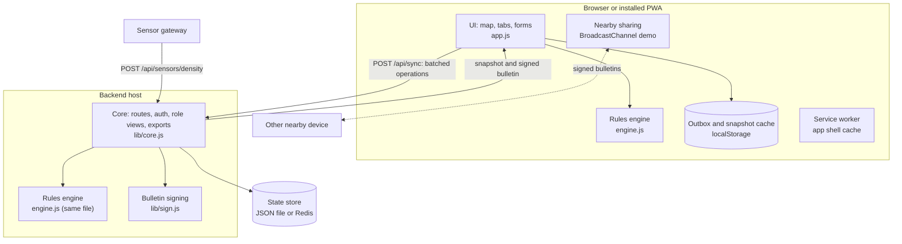
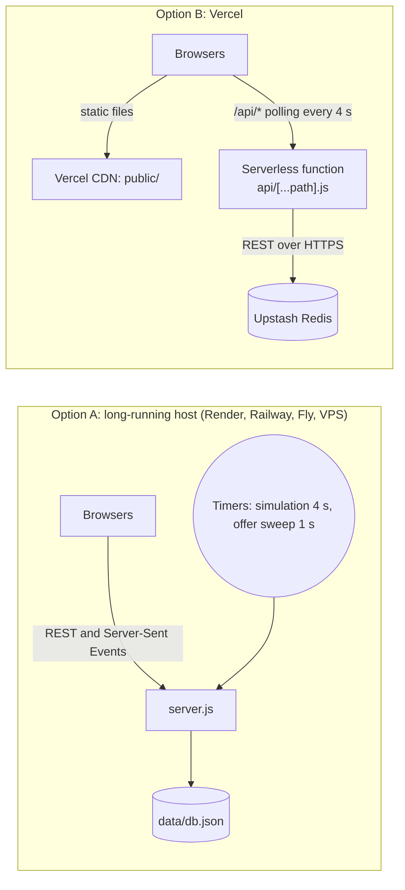
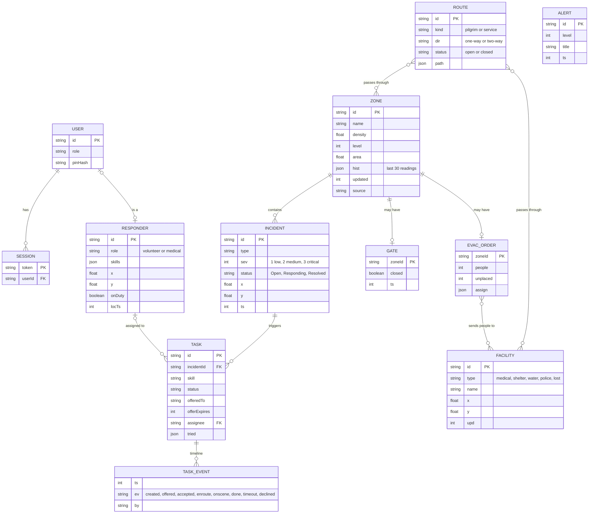
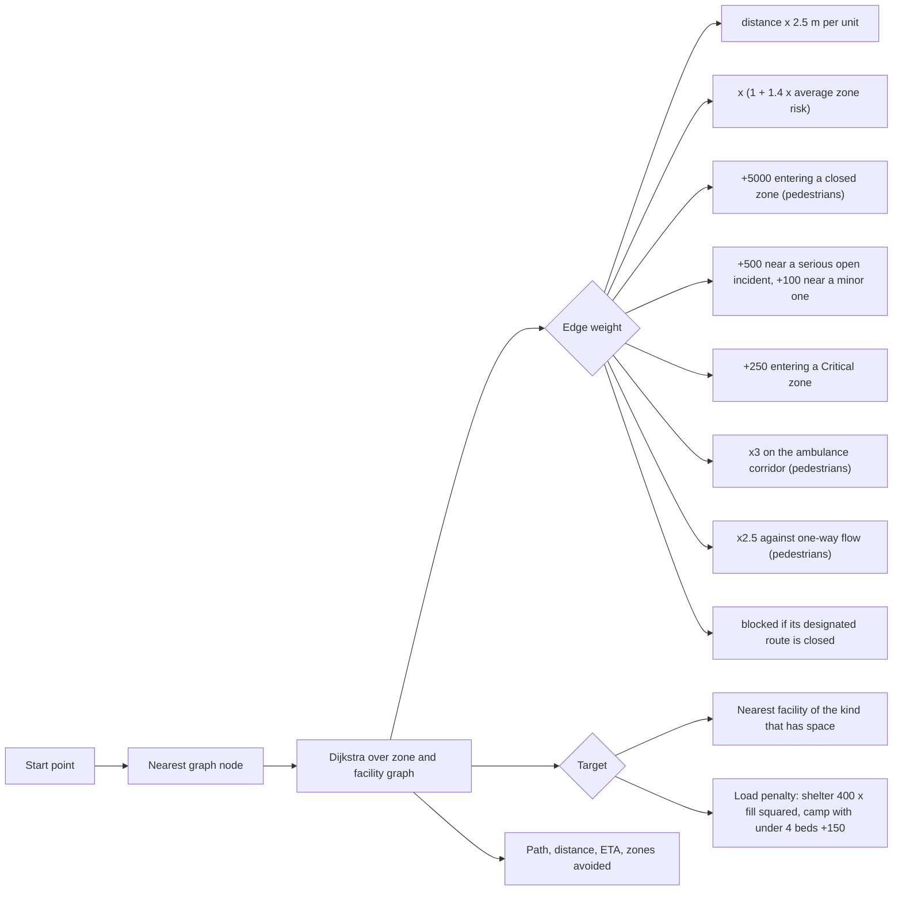
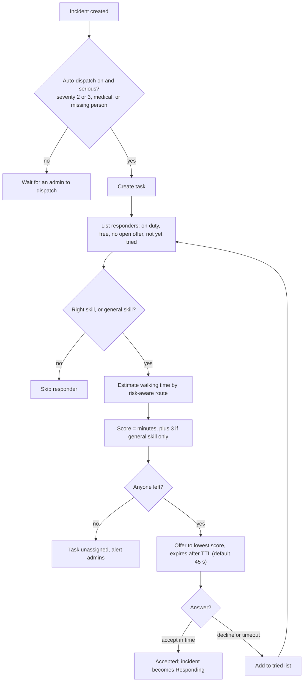
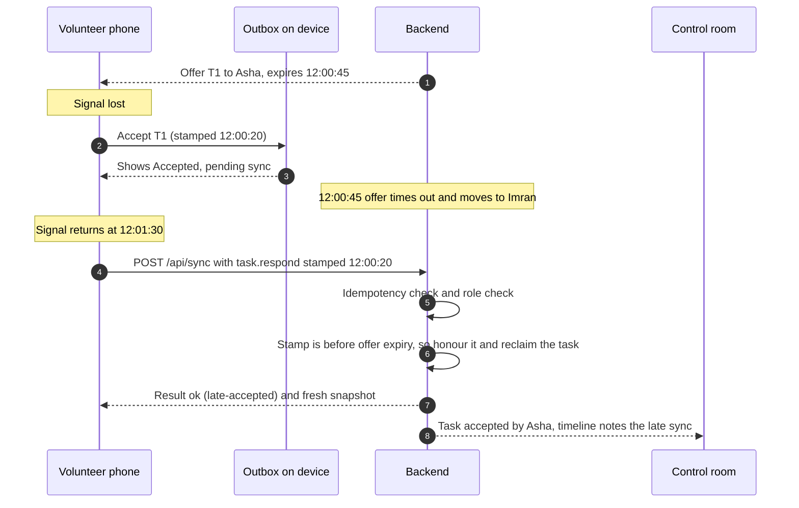
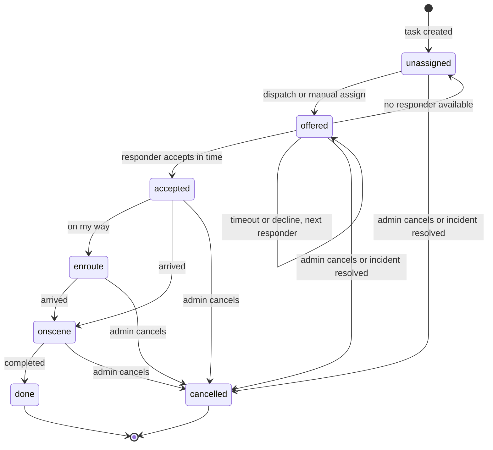
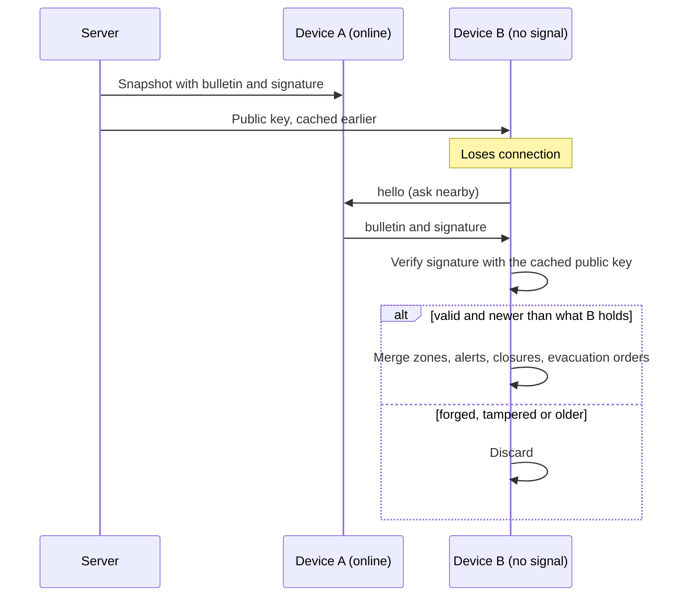
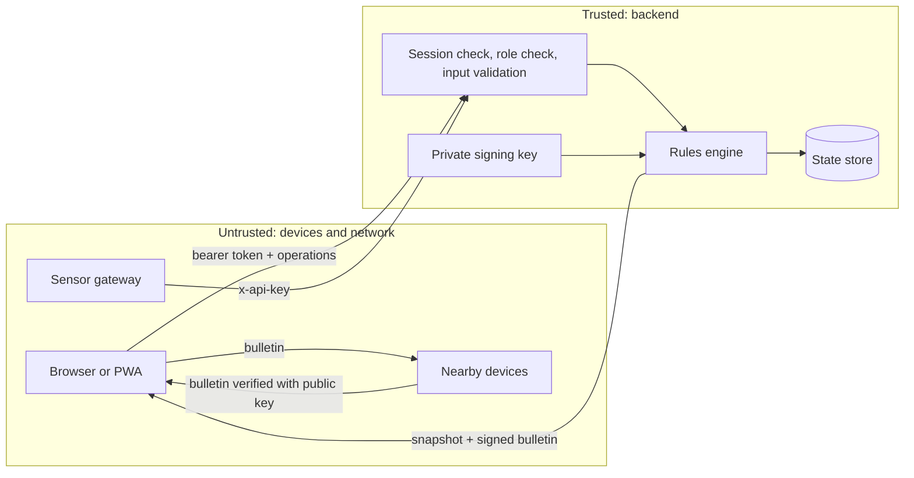

# CDERT Technical Design Document

**Product:** Crowd Disaster & Emergency Resource Tracker (CDERT)
**Version:** 1.0
**Audience:** developers, reviewers, and operators evaluating or extending the system

Diagrams are written in [Mermaid](https://mermaid.js.org/), which GitHub renders directly in the browser.

---

## 1. Purpose and scope

Large gatherings such as the Kumbh Mela put millions of people in dense areas. When crowds surge or networks fail, visitors, volunteers, medical teams and authorities lose the ability to coordinate. CDERT is an offline-capable, mobile-first platform that keeps safety information available without signal and gives authorities a shared, timestamped picture of crowd risk, incidents, resources and responders.

**In scope:** crowd-risk mapping, incident management, volunteer dispatch, evacuation planning, resource tracking, offline operation and sync, GIS export, role-based access.

**Out of scope for this version:** real map tiles and live GPS, real camera analytics, push notifications over mobile networks, identity federation, and peer-to-peer transport beyond a browser demo (see section 15).

### Design goals

| Goal | What it means in practice |
|---|---|
| Works without signal | The app shell, last known data and the user's own changes live on the device |
| Trustworthy under uncertainty | Every update carries time and location; freshness is always shown |
| Safe by default | Roles are enforced on the server; visitors see no responder identities or incident notes |
| One set of rules | The same engine runs on the server and in the browser, so offline previews match server results |
| Cheap to run | No npm dependencies, one small server or one serverless function plus Redis |

---

## 2. Requirements traceability

| Abstract statement | Design response | Where |
|---|---|---|
| Offline-capable, mobile-based | PWA with service worker; snapshot cache and outbox in `localStorage` | `public/sw.js`, `public/app.js` |
| Pre-downloaded maps, routes, facilities, camps, shelters | Map and graph are part of every snapshot and cached; designated routes with status | `engine.js` seed, snapshot view |
| GIS-based crowd-risk mapping | Zones with density, four risk levels, GeoJSON export | `engine.js` (`lvlRaw`, `geojson`) |
| Density from authorized monitoring sources, risk levels, alerts | API-key protected ingest, hysteresis, alert generation | `/api/sensors/density`, `ingestDensity`, `checkLevel` |
| Real-time incident management | Incident and task operations with SSE or polling updates | `incident.*`, `task.*` ops |
| Identify location, safer evacuation routes, direct people to facilities | Risk-weighted routing, evacuation planner, nearest facility with capacity | `computeRoute`, `evacPlan` |
| Role-based architecture | Four roles; permission table checked in the engine | `PERM`, `applyOp` |
| Local storage and synchronization | Outbox, idempotent batch sync, timestamp-based conflict rules | `/api/sync` |
| Timestamp and location on updates; freshness | Every record has `ts`/`upd`; UI shows Fresh, Aging, Stale | `app.js` (`fresh`) |
| Reduce response time | Auto-dispatch, escalation, response-time analytics | `dispatch`, `sweep`, `insights` |
| Prevent crowd incidents | Trend and forecast alerts, entry gates, recommended actions | `trend`, `recommendations` |
| Efficient deployment of services | Resource tracking and deployment advice | `recommendations`, Resources tab |
| Connectivity-resilient, low-cost, scalable | Offline mode, signed bulletins between devices, two hosting options | sections 4 and 10 |

---

## 3. Architecture

### 3.1 System context

### 3.2 Components

**Key idea:** `public/engine.js` is a pure, dependency-free module loaded by both the server (as a CommonJS module) and the browser (as a script). All business rules live there. The browser can therefore replay the user's unsent changes on top of the last server snapshot and show exactly what the server will later confirm.

| Module | Responsibility |
|---|---|
| `public/engine.js` | Permissions, operation handlers, task state machine, dispatch, routing, evacuation plan, forecast, recommendations, analytics, GeoJSON, crowd simulation |
| `lib/core.js` | HTTP routes, login and sessions, role-filtered snapshots, exports, signed bulletin creation |
| `lib/sign.js` | ECDSA P-256 key generation and signing |
| `server.js` | Long-running host: HTTP server, Server-Sent Events, timers, JSON-file persistence |
| `api/[...path].js` | Vercel host: Redis persistence, request lock, lazy catch-up of simulation and timeouts |
| `public/app.js` | UI, outbox, optimistic replay, connectivity handling, nearby sharing |
| `public/sw.js` | Caches the app shell so it opens with no network |

---

## 4. Deployment architecture

| Concern | Option A: `server.js` | Option B: Vercel |
|---|---|---|
| State | In memory, saved to a JSON file (400 ms debounce) | One Redis key (`cdert:db`) |
| Live updates | Server-Sent Events, about 120 ms after a change | Client polls `/api/state` every 4 s |
| Crowd simulation | Timer every 4 s | Catches up lazily, up to 6 ticks per request, with correct timestamps |
| Offer timeouts | Timer every 1 s | Checked on every request that finds an expired offer |
| Concurrency | Single process, no lock needed | Redis lock: `SET NX PX 5000`, up to 40 retries 75 ms apart |
| Transport advertised | `GET /api/health` returns `sse` | returns `poll` |

The client reads `transport` from `/api/health` and chooses SSE or polling, so one front end serves both hosts.

---

## 5. Key design decisions

| # | Decision | Why | Trade-off |
|---|---|---|---|
| 1 | One shared rules engine for server and browser | Offline previews match server outcomes; one place to test | The engine must stay free of Node and DOM APIs |
| 2 | All changes are timestamped operations, applied through one entry point (`applyOp`) | Uniform permission checks, idempotency, audit trail, easy offline queue | Handlers must be deterministic |
| 3 | The server trusts the caller's session, never the client's claimed role | Prevents privilege escalation from a tampered client | Offline users cannot sign in (they use their cached session) |
| 4 | Timestamps decide conflicts, not arrival order | Offline taps made in time must still count | Relies on client clocks; mitigated by clamping and server-time alignment (section 8.3) |
| 5 | No npm dependencies | Nothing to audit or break, trivial install | Hand-written HTTP routing |
| 6 | Whole state in one JSON document | Simple, fast at pilot scale (about 10 KB) | Does not scale to many writers; see section 13 |
| 7 | Schematic map as SVG | Works offline with no tile licence | Not a real GIS basemap |
| 8 | Signed bulletins for nearby sharing | Peers can relay data safely without trusting each other | Public key must be cached before signal is lost |
| 9 | Two hosts, one core | Vercel convenience and a no-limit option for events | Two thin adapters to maintain |

---

## 6. Data model

Notes:
- Coordinates are map units (1 unit = 2.5 m). Exports convert to WGS84 (`lon = 81.83 + x * 0.000025`, `lat = 25.44 - y * 0.0000225`), which places the schematic near the Prayagraj Sangam.
- `hist` keeps the last 30 density readings per zone for trend and charts.
- Persisted database shape: `{ st, users, sessions, done, fails, keys }`. `done` holds recent operation ids for idempotency (3000 on the Node host, 1500 on Vercel).
- `lib/core.js: ensure()` and `engine.migrateState()` upgrade databases saved by older versions.

---

## 7. Core algorithms

### 7.1 Crowd risk levels

| Density (people per m²) | Level | Reasoning |
|---|---|---|
| under 2.0 | Safe | Free movement |
| 2.0 to 3.5 | Watch | Movement restricted |
| 3.5 to 5.0 | High | Dense, risk of crowd turbulence |
| over 5.0 | Critical | Crush risk |

**Hysteresis:** the level rises as soon as a threshold is crossed but only falls after density drops 0.3 below the threshold, so alerts do not flicker around a boundary. Alerts are raised for rising to High or Critical and for easing back to Watch or Safe.

### 7.2 Trend and forecast (prevention)

A least-squares slope is fitted over the last 12 readings. A slope above 0.4 people/m² per minute is "rising", below -0.4 is "easing". For a rising zone, the time to the next threshold is `(threshold - density) / slope`. If that is 3 minutes or less and the next level is High or worse, the engine raises a forecast alert, with a 3-minute cooldown per zone. The 0.4 floor sits well above the noise of the simulated feed.

### 7.3 Risk-aware routing

- "Has space" means a medical camp with free beds, a shelter below capacity, or a water point not out of service.
- Responders (`service: true`) ignore the corridor, one-way and entry-gate penalties because they must reach incidents.
- A second pass without risk weights finds the naive shortest path so the UI can say which crowded zones were avoided.
- ETA uses a walking speed of `1.1 - 0.2 x worst zone level on the path` m/s, never below 0.45.
- The graph has 17 nodes, so one route takes about 0.2 ms.

### 7.4 Dispatch and escalation

### 7.5 Evacuation planner

1. People to move = `(density - 3.0) x zone area`, the number needed to bring the zone back to a comfortable 3 people/m².
2. For each shelter with free space, compute the safe route from the zone and sort by distance.
3. Fill the nearest shelter first up to its free capacity, then the next.
4. Report anything left as "unplaced": people who need other open ground. The plan never promises space that does not exist.

Issuing an order stores the plan, closes entry to the zone and raises a Critical alert listing each shelter, headcount and walking time.

### 7.6 Recommendations and analytics

`recommendations()` is a rule list for control-room staff: close entry to a risky or fast-rising zone, plan an evacuation for a Critical zone, pre-position an ambulance when the nearest ready one is more than 4 minutes away, request crowd control when no free volunteer is within 5 minutes, redirect overflow from shelters at or above 85%, and flag camps under 15% free beds or water points out of service. Each can carry a one-tap action.

`insights()` computes average time to accept, average time to reach the scene, the percentage on scene within 5 minutes, escalation count, incident counts by type, peak density per zone, and bed and shelter use. All inputs are task timelines and zone history, so no extra storage is needed.

Measured on a development laptop: route 0.2 ms, candidate ranking 0.4 ms, evacuation plan 0.5 ms, recommendations 0.8 ms.

---

## 8. Offline-first design and synchronization

### 8.1 Data flow

1. The client keeps the last server **snapshot** (`D`) and an **outbox** of operations not yet acknowledged.
2. The screen shows `V = D + outbox replayed through the shared engine`. Items touched by unsent operations are marked "Pending sync".
3. When online, the outbox is sent to `POST /api/sync`. The server returns a result per operation and a fresh snapshot, which replaces `D`.

### 8.2 Conflict rules

| Situation | Rule |
|---|---|
| Same operation sent twice | Ignored by operation id (`duplicate`) |
| Accept stamped before the offer expired | Honoured, even if the task was re-offered, as long as nobody else has accepted |
| Accept stamped after expiry | Rejected with `expired` and a plain message |
| Someone else already accepted | Rejected with `conflict` |
| Resource edit (beds, shelter, water) older than the stored value | Rejected as `stale` |
| Crowd reading older than the sensor reading | Stored as a "ground report" next to the sensor value; does not overwrite it |
| Progress step that is not forward | Treated as already done (`duplicate`) |
| Location update older than the stored one | Ignored |

### 8.3 Time handling

- Operations carry the device's clock, aligned to the server by the offset seen in the last snapshot (`serverTime - Date.now()`).
- The server clamps any timestamp to at most 5 seconds in the future, so a wrong clock cannot place an update ahead of newer data.
- "Fast-forward" in the demo only shifts how freshness is displayed; it never changes the timestamps sent to the server.

### 8.4 Connectivity states

- **Online (SSE or polling):** snapshots refresh the view; the outbox is flushed immediately.
- **Offline (no signal or the demo switch):** no network calls; the cached snapshot and outbox are used; the header and a banner say so.
- **Reconnect:** the outbox is flushed first, then a fresh snapshot is fetched, then live updates resume.
- The service worker serves the app shell from cache when the network is unavailable, and never caches API responses.

---

## 9. Task lifecycle

Only the assignee (or an admin) can move a task forward. Every transition appends an event with time and actor, so the timeline is the audit trail and the source of the response-time analytics.

---

## 10. Nearby-device sharing with signed bulletins

Each snapshot includes a **bulletin**: crowd levels, the latest alerts, entry closures, route status and evacuation orders, as a JSON string plus an ECDSA P-256 signature made by the server's private key. The matching public key is served at `/api/pubkey` and cached by the client while online.

Properties:
- **Integrity:** altering any byte of the payload fails verification (covered by a test).
- **Freshness:** a bulletin is accepted only if its timestamp is newer than what the device already holds, which blocks replay of old data.
- **Scope:** bulletins carry only public information. Responders, tasks and incident notes are never included.
- **Transport:** the demo uses `BroadcastChannel` between tabs of one browser. The signing and verification logic is transport-independent, so Bluetooth LE or Wi-Fi Direct can carry the same messages in a native or hybrid build.

---

## 11. API design

All paths are under `/api`. Reads use JSON snapshots; writes go through a single endpoint.

| Method and path | Who | Purpose |
|---|---|---|
| `GET /health` | anyone | Liveness and transport (`sse` or `poll`) |
| `GET /pubkey` | anyone | Public key (JWK) for bulletin verification |
| `GET /users` | anyone | Sign-in list; shows PIN hints only when `DEMO` is on |
| `POST /login`, `POST /logout` | anyone | PIN sign-in, bearer token; 8 failed attempts per minute per user then 429 |
| `GET /state` | anyone | Role-filtered snapshot including the signed bulletin |
| `GET /events` | anyone | Server-Sent Events stream of snapshots (`server.js` only) |
| `POST /sync` | anyone | Batch of up to 200 operations; per-operation results and a fresh snapshot |
| `POST /sensors/density` | `x-api-key` | Authorized monitoring feed |
| `POST /admin/demo`, `POST /admin/reset` | admin | Surge, calm, reset demo data |
| `GET /export/geojson`, `/export/incidents.csv`, `/export/tasks.csv` | admin | GIS and after-action export |

### Operations accepted by `POST /sync`

| Operation | Who may send it | Notes |
|---|---|---|
| `incident.create` | everyone (visitors only with `sos: true`) | Auto-dispatches serious cases |
| `incident.status` | volunteer, medical, admin | Resolving requires medical or admin |
| `zone.reading` | volunteer, admin | Ground report |
| `fac.update` | volunteer, medical, admin | Bed and ambulance counts need medical or admin |
| `alert.broadcast` | admin | |
| `task.create`, `task.assign`, `task.cancel` | admin | |
| `task.respond` | volunteer, medical | Only the responder the task was offered to |
| `task.progress` | volunteer, medical, admin | Assignee or admin only |
| `vol.update` | volunteer, medical, admin | Own location and duty status; admin for anyone |
| `route.set`, `zone.gate`, `evac.order`, `evac.clear`, `settings.update` | admin | |

Responses to `/sync` look like `{ results: [{ id, ok, code?, msg? }], snapshot }`. Codes in use: `forbidden`, `bad`, `notfound`, `conflict`, `expired`, `stale`, `duplicate`, `late-accepted`, `recorded-older`.

---

## 12. Security and privacy

| Threat | Mitigation |
|---|---|
| A client pretends to be an admin | Role comes from the server-side session; the engine rejects operations the role may not perform |
| Replaying or duplicating a batch | Operation ids stored and ignored on repeat |
| Guessing PINs | 8 attempts per minute per account, PINs stored as SHA-256 hashes, tokens are 192-bit random |
| Fake sensor data | `x-api-key` required; use a long random `SENSOR_KEY` |
| Forged alert passed between devices | ECDSA signature check, newer-timestamp rule |
| Visitors learning who responders are | Visitor snapshots exclude responders, tasks, notes and authors; SOS status is reduced to a generic phrase and ETA |
| Malformed or oversized input | 1 MB body limit, 200-operation limit, type and range checks on every operation, text fields length-capped, all output escaped before rendering |
| Path traversal on static files | Normalised path must stay inside `public/` |
| Clock abuse | Future timestamps clamped to 5 seconds ahead |

**Known gaps for production:** demo PINs and a single shared secret per account are not real identity; use OTP or SSO. Tokens appear in export links for convenience and should become short-lived headers or one-time links. Add HTTPS everywhere (Vercel does this automatically), rate limiting at the edge, and an audit log shipped off the box. Responder location is personal data; define retention and consent before real use.

---

## 13. Non-functional characteristics

| Area | Current behaviour | Notes |
|---|---|---|
| Payload size | Admin snapshot about 10 KB, visitor about 7 KB | Small enough for poor mobile links |
| Update latency | SSE about 120 ms; polling up to 4 s | |
| Compute | Under 1 ms per routing, dispatch or planning call | Pure in-memory work |
| Capacity | Pilot scale: dozens of responders, hundreds of devices | One state document; one write at a time |
| Scaling path | Move state to PostgreSQL; fan out with Redis pub/sub; read from CDN-cached public snapshots; split admin writes from visitor reads | The engine stays unchanged |
| Availability | Clients keep working from cache when the server is unreachable; server restarts reload from file or Redis | Add a managed database and health checks in production |
| Observability | `/api/health`, rejected-operation log lines, operation timeline on every task | Add structured logs and metrics for production |
| Accessibility | Risk shown by text and hatching as well as colour; controls are real buttons; dark mode follows the system; reduced-motion respected | Screen-reader pass still recommended |
| Compatibility | Node 18 or newer; modern browsers with WebCrypto and service workers over HTTPS | |

---

## 14. Testing strategy

| Layer | Approach | Files |
|---|---|---|
| Rules | Unit tests on the engine: routing, closures, gates, evacuation, forecast, recommendations, analytics, GeoJSON, migration | `test/features.test.js` |
| API | Black-box tests over HTTP: auth, privacy, roles, idempotency, conflicts, signing | `test/api.test.js`, `test/features.test.js` |
| Serverless host | The same behaviours through the Vercel handler with the in-memory store | `test/vercel.test.js` |
| End to end | A scripted scenario of 17 checks that also runs against a live server | `samples/scenario.js`, `test/samples.test.js` |
| Samples | Sample files are validated so documentation cannot drift | `test/samples.test.js` |
| UI | Manual cases in [`TEST_CASES.md`](TEST_CASES.md) | |

Run everything with `npm test` (35 automated tests). The CI workflow runs them on Node 18, 20 and 22.

---

## 15. Limitations and roadmap

**Known limits of this version**
- The map is a schematic SVG with approximate coordinates, not real tiles or live GPS.
- Crowd data is simulated until a real feed posts to `/api/sensors/density`.
- Nearby sharing is a browser-tab demonstration of the signed-bulletin design.
- Single-document state, demo authentication, and polling on Vercel limit scale and real-world use.
- Evacuation numbers are planning aids based on density times area. They do not replace trained crowd-safety staff.

**Suggested next steps**
1. Real basemap (MapLibre) with an offline tile pack and device GPS.
2. Camera analytics integration and sensor health monitoring.
3. PostgreSQL storage, Redis pub/sub, and edge caching of public snapshots.
4. OTP or SSO sign-in, short-lived tokens, audit log export.
5. Bluetooth LE or Wi-Fi Direct transport for bulletins, and relaying of signed operations from peers.
6. Push notifications and SMS fallback for visitors with no data connection.
7. More languages for alerts and the safety guide.
